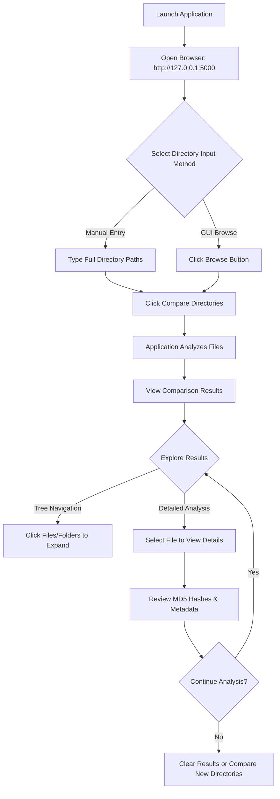
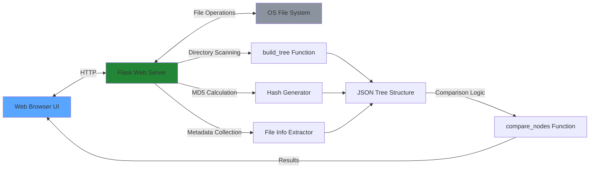

# xsukax Directory Tree Comparison Tool


A powerful, privacy-focused single-file web application for comparing two directory trees with detailed file analysis, content verification, and an elegant GitHub-inspired interface.

## 🎯 Project Overview

The xsukax Directory Tree Comparison Tool is a comprehensive solution designed for developers, system administrators, and power users who need to compare directory structures and verify file integrity across different locations. Built as a self-contained Python application, it combines the power of Flask for the web interface with native system tools for deep file analysis.

**Key Capabilities:**
- **Visual Directory Comparison**: Side-by-side tree view of two directory structures
- **Content Verification**: MD5 hash-based comparison to detect even minor file changes
- **Detailed Metadata Analysis**: Compare file sizes, creation dates, modification times, and access timestamps
- **Interactive Interface**: GitHub-inspired dark theme with intuitive navigation
- **Cross-Platform Support**: Works seamlessly on Windows, macOS, and Linux
- **Zero Installation Complexity**: Single Python file - no complex setup required

## 🔒 Security and Privacy Benefits

This tool prioritizes user security and data privacy through its architectural design:

**Complete Local Processing**: All directory scanning, file comparison, and hash calculations occur entirely on your local machine. No data is ever transmitted to external servers, ensuring your sensitive file information remains private and secure.

**No Data Persistence**: The application does not store, log, or cache any file information between sessions. All comparison data exists only in memory during active use and is cleared when the browser session ends.

**Open Source Transparency**: The complete source code is publicly available, allowing security audits and verification of data handling practices. Users can inspect exactly how their data is processed without hidden functionality.

**Isolated Execution**: Runs as a local web server (127.0.0.1) accessible only from your machine, preventing unauthorized network access or remote exploitation vectors.

**No External Dependencies**: Beyond standard Python libraries (Flask, tkinter), the tool requires no third-party services or API connections that could introduce security vulnerabilities or privacy concerns.

**MD5 Hash Verification**: Uses cryptographic hashing to verify file integrity without exposing file contents, providing secure content comparison while maintaining privacy.

## ✨ Features and Advantages

**Visual Comparison Interface**
- Dual-pane tree view for intuitive side-by-side directory comparison
- Color-coded status indicators (identical, different, missing files)
- Expandable/collapsible folder structure for organized navigation
- Real-time summary statistics (identical, different, and missing file counts)

**Comprehensive File Analysis**
- MD5 hash calculation for accurate content verification
- Detailed metadata display: file size, size on disk, creation/modification/access timestamps
- Support for Unicode filenames and paths across all platforms
- Graceful handling of permission-restricted files and directories

**User Experience Excellence**
- GitHub-inspired dark theme interface with modern aesthetics
- Native folder browser integration via tkinter dialogs
- Responsive design with smooth animations and transitions
- Non-blocking operations with loading indicators
- Clear error messaging and user feedback

**Technical Advantages**
- Single-file deployment - no complex installation process
- Lightweight footprint with minimal resource consumption
- Cross-platform compatibility with platform-specific optimizations
- No database requirements or external service dependencies
- Self-contained HTML/CSS/JavaScript for offline operation

## 📦 Installation Instructions

**Prerequisites:**
- Python 3.7 or higher installed on your system
- pip package manager (included with Python)

**Step 1: Download the Application**
```bash
# Clone the repository
git clone https://github.com/xsukax/xsukax-Directory-Tree-Comparison-Tool.git
cd xsukax-Directory-Tree-Comparison-Tool

# Or download directly
wget https://raw.githubusercontent.com/xsukax/xsukax-Directory-Tree-Comparison-Tool/main/xsukax-Directory-Tree-Comparator.py
```

**Step 2: Install Dependencies**
```bash
# Install Flask (the only external dependency)
pip install flask

# For Python virtual environment (recommended):
python -m venv venv
source venv/bin/activate  # On Windows: venv\Scripts\activate
pip install flask
```

**Step 3: Verify Installation**
```bash
python xsukax-Directory-Tree-Comparator.py
```

You should see:
```
======================================================================
xsukax Directory Tree Comparison Tool
======================================================================

Starting server on http://127.0.0.1:5000
Press Ctrl+C to stop the server
```

**Platform-Specific Notes:**

*Windows:*
- Tkinter is included with Python by default
- UTF-8 encoding is automatically configured for proper Unicode support

*macOS:*
- Tkinter may require XQuartz for GUI dialogs: `brew install --cask xquartz`

*Linux:*
```bash
# Ubuntu/Debian
sudo apt-get install python3-tk

# Fedora/RHEL
sudo dnf install python3-tkinter

# Arch Linux
sudo pacman -S tk
```

## 📖 Usage Guide

**Basic Workflow:**



**Step-by-Step Instructions:**

**1. Launch the Application**
```bash
python xsukax-Directory-Tree-Comparator.py
```

**2. Access the Web Interface**
- Open your web browser
- Navigate to `http://127.0.0.1:5000`
- The application runs locally and is only accessible from your machine

**3. Select Directories to Compare**

*Method A: Manual Path Entry*
- Enter full directory paths in "Directory 1" and "Directory 2" fields
- Windows example: `C:\Users\YourName\Documents\Folder1`
- macOS/Linux example: `/home/username/documents/folder1`

*Method B: GUI Browser*
- Click the "📁 Browse" button next to each directory field
- Navigate and select folders using the native file dialog
- Selected paths will automatically populate the input fields

**4. Execute Comparison**
- Click "🔍 Compare Directories" button
- Loading indicator appears during analysis
- Large directories may take longer to process

**5. Interpret Results**

**Summary Statistics:**
- **Identical Files**: Files with matching MD5 hashes (green)
- **Different Files**: Files with different content (red)
- **Missing Files**: Files present in one directory but not the other (gray)

**Tree Navigation:**
- Click folder names to expand/collapse directory structures
- Files are color-coded by status:
  - 🟢 Green border: Identical content
  - 🔴 Red border: Different content
  - ⚪ Gray border: Missing in comparison directory

**Detailed File Information:**
- Click any file to view comprehensive metadata in the right panel
- Compare side-by-side: size, timestamps, MD5 hashes
- Verify exact differences between file versions

**6. Additional Actions**
- **Clear Results**: Reset the interface for new comparison
- **New Comparison**: Enter different directory paths and compare again

**Application Architecture:**



**Common Use Cases:**

**Backup Verification:**
Compare original files with backup copies to ensure data integrity and verify successful backup operations.

**Code Deployment:**
Verify that deployed application files match source repository to catch deployment errors or missing files.

**Synchronization Audit:**
Check if cloud sync or file transfer operations completed correctly across different storage locations.

**Version Control:**
Compare different versions of project directories to identify which files changed between releases.

**Migration Validation:**
Ensure all files transferred successfully when moving data between systems or storage devices.

## 📄 Licensing Information

This project is licensed under the GNU General Public License v3.0, which allows you to freely use, modify, and distribute the software while requiring that derivative works remain open source under the same license.

---

**Author:** xsukax  
**Repository:** [https://github.com/xsukax/xsukax-Directory-Tree-Comparison-Tool](https://github.com/xsukax/xsukax-Directory-Tree-Comparison-Tool)  
**Issues & Support:** [GitHub Issues](https://github.com/xsukax/xsukax-Directory-Tree-Comparison-Tool/issues)

**Contributing:** Contributions are welcome! Please feel free to submit pull requests, report bugs, or suggest new features through GitHub Issues.
